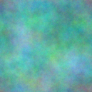
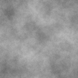

# Diamond Square CUDA implementation

Quite fast and slim diamond square GPGPU implementation, no recursion and minimal branching. 
Uses DirectX11 for visualization.

## Example output

## Building
Sorry, no cmake :-/ (yet!).
Uses the windows SDK for DirectX11 so no cross-platform anyways :P.
Get yourself a fresh copy of visual studio and rock away with the .sln file!
